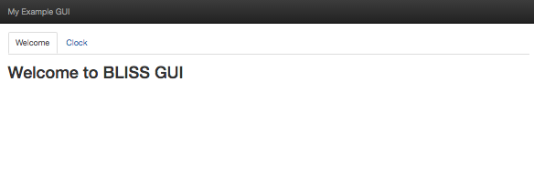

New Project Setup
=================

The following documentation will teach you how to get started using AIT GUI to build a MOS website for your project. The guide assumes that you've created a repository in which your project's GUI code will reside and that it is a Python based project. It also assumes that you've run through the `AIT Core New Project Setup <https://ait-core.readthedocs.io/en/latest/project_setup.html>`_ guide as well.

Note, we're using the following directory layout in this example. You can use it as a reference to understand why we have paths specified the way we do:

.. code-block:: bash

   myexamplegui/
   ├── html
   │   └── index.html
   └── setup.py

Add AIT GUI to Project Dependencies
-----------------------------------

You'll need to add AIT GUI to either your **requirements.txt** file or your **setup.py** file.

If you use a requirements file for specifying dependencies:

.. code-block:: bash

   ait-gui==1.0.0

If you use **setup.py** for specifying dependencies:

.. code-block:: bash

   install_requires = [
       ait-gui==1.0.0
   ],

Creating a Simple Index File
----------------------------

Now that we are depending on AIT GUI let's get a simple index page up and running. The following simple page will give us something to look at once we get the GUI started:

.. code-block:: html

   <!doctype html>
   <head>
     <link rel="stylesheet" href="ait/gui/static/build/ait.bundle.css">
     
   </head>
   <body>

   

     

       

         <a class="navbar-brand" href="#">My Example GUI</a> 
       

     

   

   

     <ait-tabset class="nav-tabs">
       <ait-tab title="Welcome">
         <h1>Welcome to AIT GUI</h1>
       </ait-tab>
       <ait-tab title="Clock">
         <h1>The current time</h1>
         <ait-clock class="navbar-text" doy="true"></ait-clock>
       </ait-tab>
     </ait-tabset>
   </body>

Setup GUI Config Values
-----------------------

You'll need to update your **server** configuration to enable the GUI Plugin. Add the plugin configuration below to the **server** section of your **config.yaml** file.

.. code-block:: yaml

   plugins:
       - plugin:
           name: ait.gui.AITGUIPlugin
           inputs:
               - log_stream
               - telem_stream
           outputs:
               - command_stream

The definitions for **log_stream**, **telem_stream**, and **command_stream** exist in the example Core **config.yaml** file.

Run the GUI
-----------

The GUI Plugin runs as part of the AIT Server. Bootup the server with:

.. code-block:: bash

   ait-server

Open up your browser of choice and point it at **localhost:8080**. You should see something that looks like the following.

Congratulations! You've successfully gotten your project setup and ready for development with AIT GUI.
